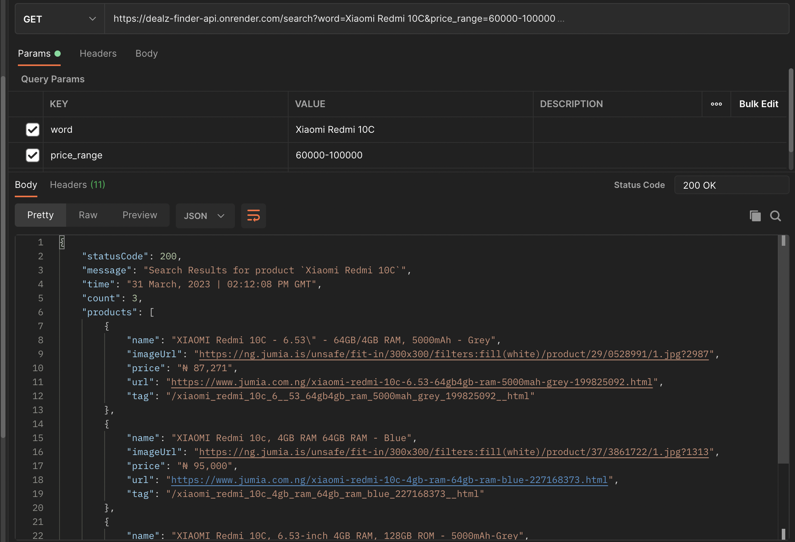

# Product Deals Alerter

<div align="center">
  <h3 align="center">Product Price Alerter on Jumia &amp; Konga.</h3>

  <p align="center">
    Get product deals updates
    <br />
    <a href="https://dealz.onrender.com">View Demo</a>
  </p>
</div>


<!-- TABLE OF CONTENTS -->
<details>
  <summary>Table of Contents</summary>
  <ol>
    <li>
      <a href="#about-the-project">About The Project</a>
      <ul>
        <li><a href="#endpoints">API Endpoints</a></li>
        <li><a href="#built-with">Built With</a></li>
      </ul>
    </li>
    <li>
      <a href="#getting-started">Getting Started</a>
      <ul>
        <li><a href="#prerequisites">Prerequisites</a></li>
        <li><a href="#installation">Installation</a></li>
      </ul>
    </li>
    <li><a href="#usage">Usage</a></li>
    <li><a href="#license">License</a></li>
  </ol>
</details>


<!-- ABOUT THE PROJECT -->
## About The Project
 An app that creates tasks that scrapes and keep searching for deals on products that falls within a given price range & notifies you with the link to the product on the e-commerce websites.

### Given requirements 
* A user can search for a product within a price range

### Built With
* Python
* FastAPI
* Selenium
* Chromium
* BeautifulSoup
* Postman


### API Swagger Docs
[https://dealz.onrender.com/docs](https://dealz.onrender.com/docs)

  
### Endpoints:

#### Search for product

`GET /search?word=product-name-here&price_range=1000-5000`

Required query param: `word`, `price_range`


### HTTP Response Status codes:

* 200 for OK
* 400 for Bad requests
* 500 for Internal Server Error

<p align="right">(<a href="#readme-top">back to top</a>)</p>


<!-- GETTING STARTED -->
## Getting Started

### Prerequisites

* To run this project, make sure you have Python installed on your machine.

### Installation

1. Clone the repo
   ```sh
   git clone https://github.com/rafmme/price-alerter.git
   ```
2. Change directory (cd) to the search folder ```cd search``` then create and activate a python virtual env 

3. Run this command ```pip install -r requirements.txt``` to install the project dependencies.
4. To start the application server up, run this command ```uvicorn main:app --port 6778```
5. Navigate to port 6778 to see the app server in action.

<p align="right">(<a href="#readme-top">back to top</a>)</p>


<!-- USAGE EXAMPLES -->
## Usage

<div style="text-align:center">
    
</div>

<p align="right">(<a href="#readme-top">back to top</a>)</p>

<!-- LICENSE -->
## License

Distributed under the MIT License. See `LICENSE.txt` for more information.

<p align="right">(<a href="#readme-top">back to top</a>)</p>

